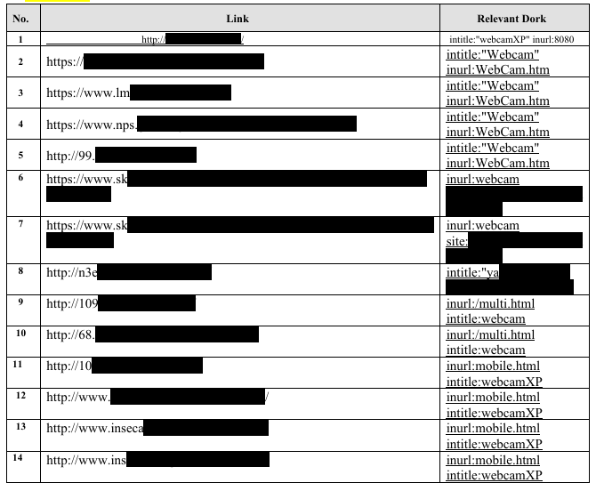
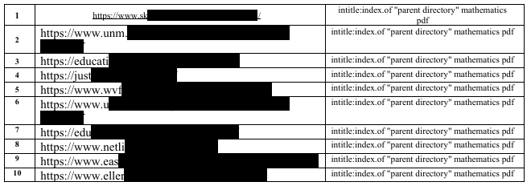

# 🔎 GHDB & Google Search Operators — Cybersecurity Lab


## Overview

As part of my cybersecurity and ethical hacking training with **Networkwalks**, I completed a practical exercise focused on the **Google Hacking Database (GHDB)** and advanced Google search operators.

The exercise demonstrated how carefully constructed search queries can be used during reconnaissance to identify information that has been publicly indexed by search engines.

The practical work covered two main areas:

1. Identifying publicly indexed webcam/web interfaces.
2. Identifying publicly accessible mathematics-related PDF files and directory listings.

The objective was to understand how search engines can support reconnaissance and how the same techniques can be used defensively to identify unintended public exposure.

---

## 🎯 Objectives

* Understand the purpose of the Google Hacking Database (GHDB).
* Learn how advanced Google search operators work.
* Practice using search queries for information gathering.
* Understand how publicly indexed resources can contribute to an organization's attack surface.
* Identify the security implications of exposed web interfaces and directory listings.
* Understand the importance of authorization and responsible disclosure when conducting security research.

---

# 1. 🌐 Publicly Indexed Webcam/Web Interfaces

During the exercise, I studied GHDB queries designed to identify publicly indexed webcam and web-camera interfaces.

### Examples of search operators studied

```text
intitle:"webcamXP" inurl:8080
```

```text
intitle:"Webcam" inurl:WebCam.htm
```

```text
intitle:"yawcam" "It's a webcam!" "user" "pass"
```

```text
inurl:/multi.html intitle:webcam
```

```text
inurl:mobile.html intitle:webcamXP
```

These queries demonstrate how operators such as `intitle:` and `inurl:` can be combined with specific keywords to narrow search results.

### 🔍 Observation

The searches returned different types of publicly indexed webcam-related pages and interfaces.

However, **a page being publicly indexed or accessible does not automatically mean that the system is vulnerable or that the researcher is authorized to interact with it.**

For this public portfolio, the original live IP addresses, URLs and identifying information have been **redacted/blurred**.

### Evidence

The accompanying screenshots show the search methodology and results while protecting live third-party target information.



---

# 2. 📚 Mathematics PDF & Directory Listings

The second exercise involved using a search query to identify mathematics-related PDF files and directory listings.

### Search operator studied

```text
intitle:index.of "parent directory" mathematics pdf
```

### What the query demonstrates

* `intitle:index.of` — searches for pages whose title indicates an indexed directory.
* `"parent directory"` — searches for the exact phrase commonly associated with directory listings.
* `mathematics` — narrows the results to mathematics-related content.
* `pdf` — focuses the search toward PDF resources.

### 🔍 Observation

The search produced mathematics-related PDF files and directory listings from different websites.

This demonstrated how search engines can sometimes expose resources that organizations or website administrators may not have intended to be easily discoverable through ordinary navigation.

The exercise also highlighted an important distinction:

> **Publicly indexed information is not necessarily confidential, and the presence of a directory listing does not automatically indicate a security vulnerability.**

The appropriate security question is whether the information was intentionally published and whether its exposure creates an unintended security or privacy risk.

---

# 🛠️ GHDB Operators Practiced

| Operator           | Purpose                                                   |
| ------------------ | --------------------------------------------------------- |
| `intitle:`         | Searches for specific words or phrases in a webpage title |
| `inurl:`           | Searches for specific text within a webpage URL           |
| `site:`            | Restricts results to a particular domain                  |
| `filetype:`        | Searches for specific file types                          |
| `"exact phrase"`   | Searches for an exact sequence of words                   |
| `intitle:index.of` | Helps identify indexed directory-style pages              |

---

# 🔐 Security Relevance

This practical exercise demonstrated that reconnaissance is not limited to traditional security tools.

Search engines can provide useful information about publicly exposed resources, including:

* Web interfaces
* Directory listings
* Documents
* PDF files
* Technology indicators
* Public-facing services

From a defensive perspective, organizations can use similar searches against their **own domains and assets** to identify unintended exposure.

---

# 🧠 What I Learned

Through this exercise, I learned:

* How GHDB can support reconnaissance and information gathering.
* How search operators can make search results more targeted.
* How combinations of `intitle:`, `inurl:`, `site:` and exact-phrase searches can identify specific types of indexed content.
* That public exposure does not automatically mean a system is vulnerable.
* That reconnaissance findings must be interpreted carefully.
* That authorization is essential before interacting with systems discovered during security research.
* That security research should focus not only on finding information, but also on responsible handling of that information.

---

# 🛡️ Defensive Recommendations

Organizations can reduce unintended exposure by:

* Regularly reviewing publicly indexed resources.
* Checking their domains using appropriate search-engine queries.
* Removing unnecessary public directory listings.
* Avoiding unnecessary exposure of administrative interfaces.
* Applying appropriate authentication and access controls.
* Reviewing web-server configurations.
* Monitoring Internet-facing systems and services.
* Removing sensitive information from publicly accessible locations.
* Reviewing search-engine indexing and web-crawler exposure.
* Keeping Internet-facing software and devices properly maintained.

---

# ⚠️ Responsible Use

This project was completed for **educational and cybersecurity research purposes**.

The original practical exercise produced live third-party URLs and IP addresses. These have **not been published in this repository**.

Screenshots used for documentation have been sanitized by blurring/redacting identifying information.

This repository focuses on:

* Search methodology
* GHDB concepts
* Security observations
* Defensive considerations
* Lessons learned

It does not provide a directory of live third-party targets.

Security testing should only be conducted against systems that you own, your own laboratory environment, or systems for which you have explicit authorization and an agreed scope.

Unauthorized access, interaction, or testing may violate applicable laws and regulations.

---

# 📌 Conclusion

This exercise strengthened my understanding of **Google-based reconnaissance and the role of GHDB in cybersecurity**.

The main lesson was that reconnaissance can begin with information already available through public search engines. Understanding what an organization exposes online is therefore an important part of security assessment.

From a defensive perspective, the same techniques can help organizations identify unintended public exposure and reduce their external attack surface.

---

## 📷 Evidence

Sanitized screenshots are included in this repository to demonstrate the practical work while protecting live third-party information.



**Tools/Concepts:**

GHDB • Google Search Operators • OSINT • Reconnaissance • Information Gathering • Web Security • Ethical Hacking


👤 **Author**
**Ayisire I. Oghenechovwe**

Cybersecurity Intern

LinkedIn: https://www.linkedin.com/in/israel-chovwe-ayisire

-End-
